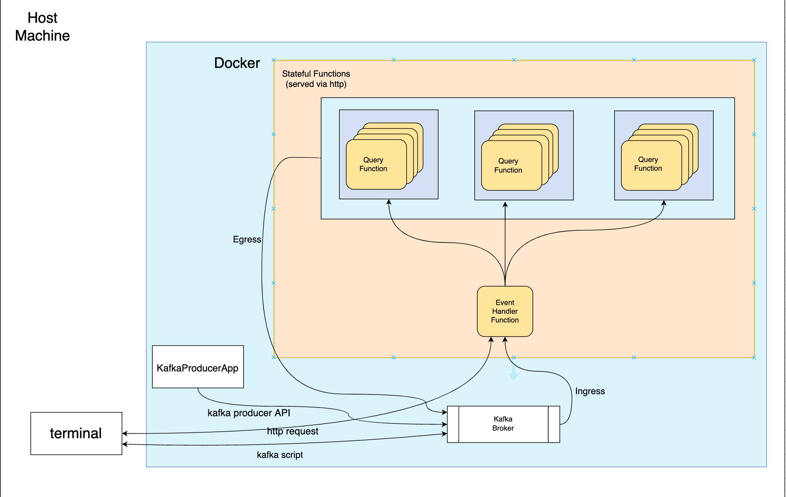

# Project Overview
This project is a research oriented project done for the Streaming Systems class at BU. The goal of the project is to learn how to build a Flink Stateful Function application that can perform streaming graph analytics. For a general overview of what streaming graph analytics is about, please refer to our project overview file [here](./%5BCS551-22_Project_6.pdf). Since we only had one semester to learn the basic concepts and do the project, this application cannot perform very advanced graph analytics, but we did learn a lot about how stateful function works and how to perform some simple graph analytics on streaming data.  
We've built APIs that can build a graph representation in stateful functions and retrieve useful information from the graph. For more details about how our program works, please see the [README](projectCode/README.md) in the `projectCode` directory.

# Contributors
This is a group project, so I want to thank each of the team members for contributing to this project. The team members are:  
- Zeyu Gu
- Xiaojie Li
- Thachathum Amornkasewong
- Adarsh Verma
- Qilin Yang

# Initial Design Document
This `Design.md` file is the initial design documents we wrote prior to starting this project. We've changed some of our plans along the way, and there's also some things we weren't able to achieve in the end.

# Architecture
The following diagram shows a simplified view of the architecture of our StateFun application:  

# Project Code
Project code is inside the `projectCode` folder, and inside that folder contains a [README](./projectCode/README.md) file with instructions on how to run the code.

