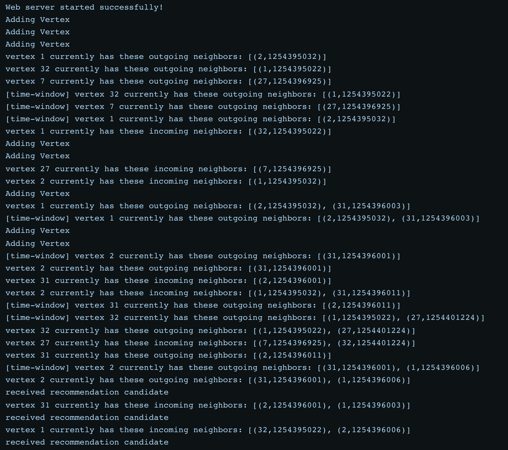
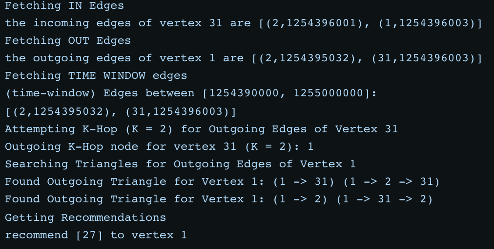

# Project 6: Temporal Graph Queries and Analysis
This is the source code for project 6.

# Readme index
[Project Structure](#project-structure-and-file-explanations)  
[Query API](#query-api)  
[Build Project](#build-project)  
[Running Queries Using HTTP](#running-queries-with-http-requests)  
[Running Queries with Kafka](#running-queries-through-apache-kafka-broker)  
[Test Application](#test)

# Project Structure and file explanations:
* `src/` contains all the source code, and `src/.../types` contains the types we need (eg. `CustomTuple2` and `Vertex` classes) for the different queries
* `src/.../KafkaProducerApp.java` contains code to read from a data file and injects messages to Kafka ingress. This program is run within the `producer` container
* `src/.../GraphAnalyticsAppServer.java`: contains the `Undertow` server that listens for requests
* `src/.../InEdgesQueryFn.java`: contains the query code for processing in-edges query, in-k-hop query, and in-triangle query
* `src/.../OutEdgesQueryFn.java`: contains the query code for processing out-edges query, out-k-hop query, and out-triangle query
* `src/.../TimeWindowQueryFn.java`: contains the query code for the time window query. See API for more details.
* `src/.../EventsFilterFn`: contains the code of our main event handler function, which receives all requests and sends each request to the appropriate query function
* `latencyTest/`: This folder contains the code to generate latency graph and the graphs themselves.
* `data/`: This folder contains the data files

# Query API
* `Time Window Query`:
    * `execute` task type: `GET_TIME_WINDOW_EDGES`
    * required parameters: `src` for vertex to query on, `t` for starting timestamp, `endTime` for ending timestamp
    * this query outputs all outgoing edges from source node `src` between time `t` and `endTime`
* `In-Edges Query`:
  * `execute` task type: `GET_IN_EDGES`
  * required parameters: `dst` for vertex to query on, `t` for timestamp (currently not used, but required)
  * this query retrieves all incoming edges of vertex `dst`
* `Out-Edges Query`:
  * `execute` task type: `GET_OUT_EDGES`
  * required parameters: `src` for vertex to query on, `t` for timestamp (currently not used, but required)
  * this query retrieves all outgoing edges of vertex `src`
* `IN-K-HOP Query`:
  * `execute` task type: `IN_K_HOP`
  * required parameters: `dst` for vertex to query on, `k` for the number of hops
  * this query retrieves the neighbor that is k hops away from node `dst` by traversing incoming edges
* `Out-K-HOP Query`:
  * `execute` task type: `OUT_K_HOP`
  * required parameters: `src` for vertex to query on, `k` for the number of hops
  * this query retrieves the neighbor that is k hops away from node `src` by traversing outgoing edges
* `IN-Triangles Query`
  * `execute` task type: `IN_TRIANGLES`
  * required parameters: `dst` for vertex to query on
  * this query retrieves the nodes within a unidirectional triangle of node `dst` by traversing incoming edges
* `OUT-Triangles Query`
  * `execute` task type: `OUT_TRIANGLES`
  * required parameters: `src` for vertex to query on
  * this query retrieves the nodes within a unidirectional triangle of node `src` by traversing outgoing edges
* `Recommendation Query`
  * `execute` task type: `GET_RECOMMENDATION`
  * required parameters: `dst` for vertex to query on, `t` for timestamp (currently not used, but required)
  * this query retrieves the potential recommendation candidates for node `dst` based on outgoing connections of an incoming neighbor of node `dst`

# Build project
* from the root directory of the source code, run `cd projectCode` to go into the actual source directory (if you are already inside the `projectCode` directory, you can skip this step)
* run `make build` to build and run the stateful functions
* open `Docker Desktop` and click `graph-analytics` to see messages being sent and received
* If you prefer reading logs produced by each container in the terminal, run `make kafka-terminal` instead
* Remember to do `docker-compose down` before each new build

__Important Note__: The zookeeper and Kafka broker container are using arm64 architecture. If you don't have Docker desktop, you might not be able to run it 
on your local machine, depending on the architecture of your machine. Try using the amd64 version of these containers.

# Run project
We currently have two ingresses, one of them takes `HTTP` requests as input events, the other one takes `Kafka` messages as
input events. Therefore, we can send events/queries via `CURL` commands or a `Kafka` producer.  
**All executable events** are of the `execute` type and follow the following `JSON` format:  
`{"task": <executable task>, "src": <src vertexid>, "dst": <dst vertexid>, "t": <timestamp>, "endTime": <endtime for time window query>, "k": <number of hops of k hop query>}`  

**Not** all of the fields are needed. For example, `endTime` and `k` are specified for specific queries, so you don't need to specify all
the fields when sending events. Check the specific query API for required fields.
The supported executable tasks are:
- `ADD`
- `GET_IN_EDGES`
- `GET_OUT_EDGES`
- `GET_TIME_WINDOW_EDGES`
- `IN_K_HOP`
- `OUT_K_HOP`
- `IN_TRIANGLES`
- `OUT_TRIANGLES`
- `GET_RECOMMENDATION`


## Running Queries with HTTP Requests
To send queries via curl command, this is the template to us:
```bash
curl -X PUT -H "Content-Type: application/vnd.graph-analytics.types/execute" -d '<execute JSON>' localhost:8090/graph-analytics.fns/filter/1
```

Examples:
```bash
# this CURL command will fetch all incoming edges for source vertex 1
curl -X PUT -H "Content-Type: application/vnd.graph-analytics.types/execute" -d '{"task": "GET_IN_EDGES", "dst": 31, "t": 1254396003}' localhost:8090/graph-analytics.fns/filter/1

# this CURL command will fetch all outgoing edges for source vertex 1 BETWEEN 1254390000 <= t <= 1255000000
curl -X PUT -H "Content-Type: application/vnd.graph-analytics.types/execute" -d '{"task": "GET_TIME_WINDOW_EDGES", "src": 1, "t": 1254390000, "endTime": 1255000000}' localhost:8090/graph-analytics.fns/filter/1
```
To see the query results, you have to read from the appropriate topics in Kafka egress, or you can simply check the logs in the graph-analytics container. For information on how to read from kafka egress, see 
the following section.

## Running Queries through Apache Kafka Broker
The Kafka is set up according to this [guide](https://developer.confluent.io/quickstart/kafka-docker/), which is set up through `docker-compose`; therefore, by running `docker-compose`, it will automatically set up the broker. After `docker-compose up -d`, topics have to be created since at the moment, automatic topics creation during start up is not set up yet. Run the follow commands to manually create topics:
```
docker exec broker \
kafka-topics --bootstrap-server broker:29092 \
             --create \
             --topic tasks
```
If you have kafka installed on your device, then you can enter this instead:
```
kafka-topics --bootstrap-server localhost:9092 \
             --create \
             --topic tasks
```
<br>

**To write to Kafka:** <br>
To write message to Kafka topic, we'll done it through kafka-console-producer command line tool. This is good for testing it out but during simulation, we'll be using Kafka Connect/Producer API to read textfiles to send graph edges to Flink Application. For sending single message, we can write the following in the terminal:
```
docker exec --interactive --tty broker \
kafka-console-producer --bootstrap-server broker:29092 \
                       --topic tasks \
                       --property parse.key=true \
                       --property key.separator="|"
```
If you have kafka installed on your device, then you can enter this instead:
```
kafka-console-producer --bootstrap-server localhost:9092 \
                       --topic tasks \
                       --property parse.key=true \
                       --property key.separator="|"
```
Then you can write messages:
```
3|{"task": "ADD", "src": "3", "dst": "4", "t": "1254194656", "k": "0"}
1|{"task": "ADD", "src": "1", "dst": "4", "t": "1254192988", "k": "0"}
```
<br>

**To read messages from Kafka on terminal:**<br>
To read messages from a "quickstart" topic:
```
docker exec --interactive --tty broker \
kafka-console-consumer --bootstrap-server broker:29092 \
                       --topic incoming-edges \
                       --from-beginning
```

If you have kafka installed on your device, then you can enter this instead:
```
kafka-console-consumer --bootstrap-server localhost:9092 \
                       --topic incoming-edges \
                       --from-beginning
```
Each topic corresponds to a specific query type  
The supported topics are:
- `incoming-edges`
- `outgoing-edges`
- `out-k-hop-result`
- `out-triangle-result`
- `in-triangle-result`
- `in-k-hop-result`
- `recommendation`
- `time-window`
<br>

**To list the topics in Kafka:** <br>
```
docker exec broker \
kafka-topics --bootstrap-server broker:29092 \
             --list
```
If you have kafka installed on your device, then you can enter this instead:
```
kafka-topics --bootstrap-server localhost:9092 \
             --list
```

**To request for metadata from the broker inside the docker:**
```
docker run -it --rm --network=projectcode_default edenhill/kcat:1.7.1 -b broker:29092 -L
```

# Test
To test our application runs correctly, please follow the steps listed below:  
1. First, `cd` into the projectCode folder. Run `make build` to build and start up all the docker containers.
2. Verify the containers are up in Docker Desktop. The producer container will be down shortly because it only sends some data to the stateful functions.
It might take a while for all the containers to initialize themselves, but you should see something similar to the following logs in 
the graph-analytics container if everything has started correctly:

3. Now, you can run some queries to test the functions. In the terminal, type the following to start a kafka console producer through the broker container:
```
docker exec --interactive --tty broker \
kafka-console-producer --bootstrap-server broker:29092 \
                       --topic tasks \
                       --property parse.key=true \
                       --property key.separator="|"
```
Then copy & paste the following queries line by line:
```
31|{"task": "GET_IN_EDGES", "dst": 31, "t": 1254396003}
1|{"task": "GET_OUT_EDGES", "src": 1, "t": 1254395032}
1|{"task": "GET_TIME_WINDOW_EDGES", "src": 1, "t": 1254390000, "endTime": 1255000000}
31|{"task": "OUT_K_HOP", "src": 31, "k": 2}
1|{"task": "OUT_TRIANGLES", "src": 1}
1|{"task": "GET_RECOMMENDATION", "dst": 1, "t": 1254395032}
```
After entering all the queries, type `ctrl d` to exit the kafka console producer interface.  
You should now see the following logs in the graph-analytics container if everything went well:

If you want to read the above query results from kafka egress, type the following in terminal:
```
docker exec --interactive --tty broker \
kafka-console-consumer --bootstrap-server broker:29092 \
                       --topic incoming-edges \
                       --from-beginning
```
This reads the query results corresponding to incoming-edges query, you can change the topic names to read results for different queries.
